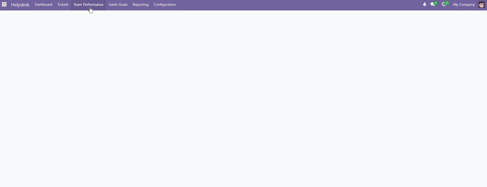

The standard Helpdesk view doesn't offer a quick way to see, at a
glance, how each person on a team is doing within a specific period
of time. This module solves that with a client action (*Team
Performance*) that:

- Groups users by **Helpdesk team** (``helpdesk.ticket.team``) marked
  to appear in the view (via the ``ticket_control`` field).
- Distinguishes between **main goals** and **extra goals** per
  ticket, using the ``extra_objetive`` field.
- Calculates each person's progress with two concentric rings (main /
  extra) around their user photo.
- Allows switching between **weekly** and **monthly** views, and
  navigating to previous or following periods without reloading the
  page.
- Shows an aggregated team summary (combined progress bar for main
  and extra goals).
- Clicking any indicator opens a side panel with the list of tickets
  for the active period, with priority, stage, due date, and a
  visual warning if a ticket is close to or past its due date.
- Allows opening any individual ticket, or the full filtered kanban
  view.

In addition, the **Gantt Goals** view shows a calendar of tickets per
user:

- Filters by default to the **current week** and shows both open and
  closed tickets for all users in the team.
- Places each ticket across the range of days spanned by its **start**
  and **end** date fields.
- Colors **closed tickets green** and **open tickets gray**, to tell
  status apart at a glance.
- Groups users by the **team** they belong to; only teams marked to
  appear in the view are shown (same ``ticket_control`` field as in
  Team Performance).
- Allows switching between **weekly** and **monthly** views, and
  navigating forward/backward to check the history of goals.
- Allows filtering by **teams** and by **contacts**.
- Clicking on a user's name creates a new ticket, **automatically
  assigned** to that person.
- Hovering over a ticket in the calendar shows a dropdown with
  additional information about that ticket; clicking it opens its
  form view to review or edit it.

