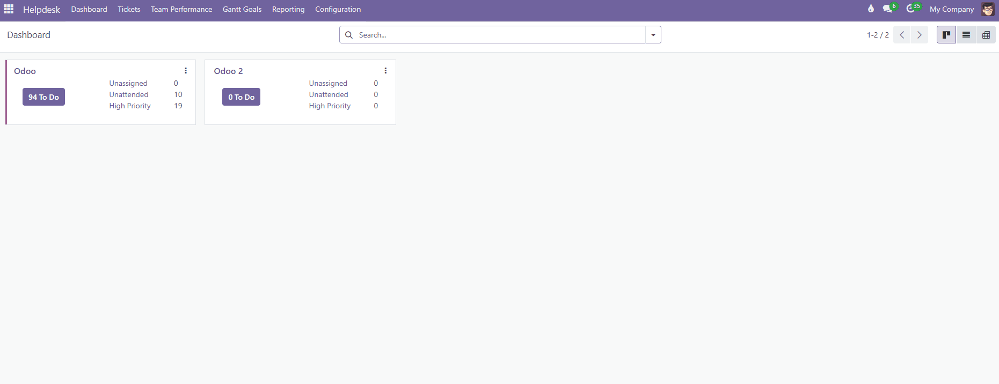
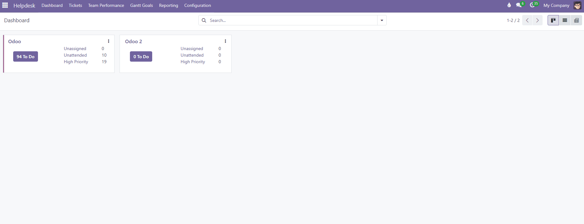

Team Performance
-----------------

To access the dashboard:

#. Go to the **Helpdesk** menu.
#. Enter **Team Performance**.
#. Use the **Week / Month** selector to change the aggregation
   period.
#. Use the ``‹`` / ``›`` arrows next to the date label to navigate to
   the previous or following period. Click the label itself to jump
   directly back to the current period.
#. Each user card shows:

   - Two progress rings (purple = main goals, teal = extra goals),
     with their percentage shown on hover.
   - Two indicators with the *closed/total* ratio for each type of
     goal.
   - A **View all tickets** button, which opens the user's full
     kanban view in Odoo.

#. Clicking on an indicator (main goals, extra goals) opens a side panel with the list of tickets for the active period, sorted with open ones first and by nearest due date.

   - If an open ticket has **2 days or less** left until its due
     date, the row **blinks in red** and the date is shown in red, to
     clearly and visibly flag urgency without needing to open the
     ticket.
   - If an open ticket has already **passed its due date**, the row
     is marked in solid red (no blinking) and the date is also shown
     in red, to distinguish "still time to act" from "already past
     due."
   - This same warning is also applied in the floating panel that
     appears when hovering over the Main/Extra bars in each team's
     header.
#. Hovering over the **Main** or **Extra** bar in a team's header
   shows a floating panel with the detail of all the team's tickets
   for that category.
#. Click on any ticket row to open its full form; when you save or
   close it, the dashboard and any open panel refresh automatically.

Gantt Goals
-----------

To access the calendar view:

#. Go to the **Helpdesk** menu.
#. Enter **Gantt Goals**.
#. By default the **current week** is shown, with all tickets (open
   and closed) for the users of the marked teams, grouped by team.
#. Use the **Week / Month** selector to change the view's
   granularity, and the ``‹`` / ``›`` arrows to move to the previous
   or following period and check the history.
#. Use the **Teams** and **Contacts** filters in the header to narrow
   down which users/tickets are shown.
#. Each bar represents a ticket, positioned according to its **start**
   / **end** date fields:

   - **Green**: closed ticket.
   - **Gray**: open ticket.

#. Click on a **user's name** to create a new ticket, automatically
   assigned to that person.
#. Hover over any ticket bar to see a dropdown with additional
   information without leaving the calendar. Click the bar to open
   the ticket's full form view.

